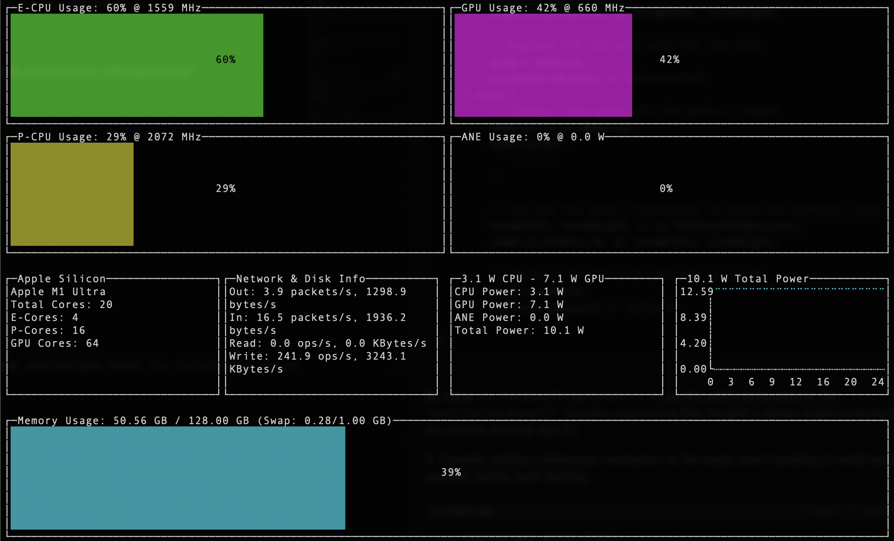
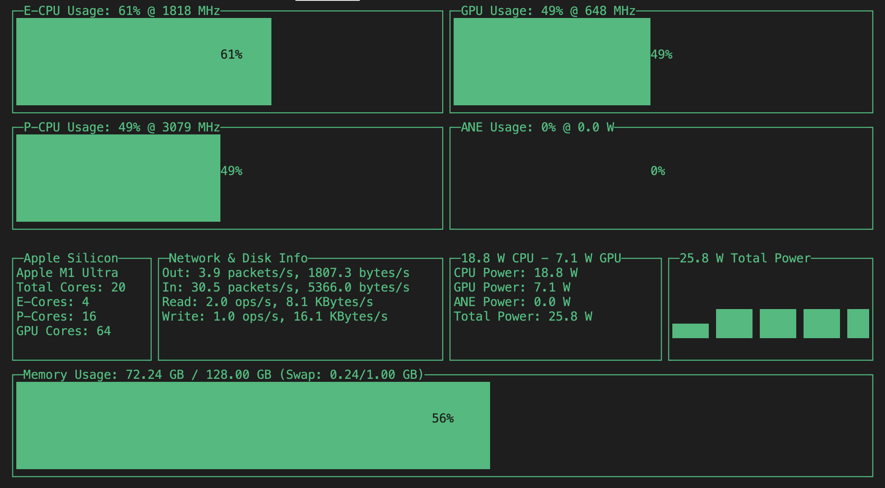

# mactop

 

`mactop` is a terminal-based monitoring tool "top" designed to display real-time metrics for Apple Silicon chips. It provides a simple and efficient way to monitor CPU and GPU usage, E-Cores and P-Cores, power consumption, and other system metrics directly from your terminal!



## Compatibility

- Apple Silicon Only (ARM64)
- macOS Monterey 12.3+

## Features

- Apple Silicon Monitor Top written in Go Lang (Under 1,000 lines of code)
- Real-time CPU and GPU power usage display.
- Detailed metrics for different CPU clusters (E-Cores and P-Cores).
- Memory usage and swap information.
- Network usage information
- Disk Activity Read/Write
- Easy-to-read terminal UI
- Two layouts: default and alternative
- Customizable UI color (green, red, blue, cyan, magenta, yellow, and white)
- Customizable update interval (default is 1000ms)
- Support for all Apple Silicon models.

## Install via Homebrew

You can install [mactop](https://github.com/context-labs/mactop) via Homebrew! https://brew.sh

```bash
brew install mactop
```

```bash
sudo mactop
```

## Updating via Homebrew

```bash
brew update
```

```bash
brew upgrade mactop
```

## Installation

To install `mactop`, follow these steps:

1. Ensure you have Go installed on your machine. If not, you can install it by following the instructions here: [Go Installation Guide](https://go.dev/doc/install).

2. Clone the repository:
   ```bash
   git clone https://github.com/context-labs/mactop.git
   cd mactop
   ```

3. Build the application:
   ```bash
   go build
   ```

4. Run the application:
   ```bash
   sudo ./mactop
   ```

## Usage

After installation, you can start `mactop` by simply running:
```bash
sudo ./mactop
```

`sudo` is required to run `mactop`

Example with flags
```bash
sudo mactop --interval 1000 --color green
```

## mactop Flags

- `--interval` or `-i`: Set the powermetrics update interval in milliseconds. Default is 1000. (For low-end M chips, you may want to increase this value)
- `--color` or `-c`: Set the UI color. Default is white. 
Options are 'green', 'red', 'blue', 'cyan', 'magenta', 'yellow', and 'white'. (-c green)
- `--version` or `-v`: Print the version of mactop.
- `--help` or `-h`: Show a help message about these flags and how to run mactop.

## mactop Commands
Use the following keys to interact with the application while its running:
- `q`: Quit the application.
- `r`: Refresh the UI data manually.
- `l`: Toggle the current layout.

## Example Theme (Green) Screenshot (sudo mactop -c green)



## Confirmed tested working M series chips

- M1
- M1 Max
- M1 Ultra
- M2
- M2 Pro
- M3
- M3 Pro
- M3 Max

(If you have a confirmed working M series chip that is not listed, please open an issue, so we may add it here!)

## Contributing

Contributions are what make the open-source community such an amazing place to learn, inspire, and create. Any contributions you make are **greatly appreciated**.

1. Fork mactop
2. Create your Feature Branch (`git checkout -b feature/AmazingFeature`)
3. Commit your Changes (`git commit -m 'Add some AmazingFeature'`)
4. Push to the Branch (`git push origin feature/AmazingFeature`)
5. Open a Pull Request

## What does mactop use to get real-time data?

- `sysctl`: For CPU model information
- `system_profiler`: For GPU Core Count
- `psutil`: For memory and swap metrics
- `powermetrics`: For majority of CPU, GPU, Network, and Disk metrics

## License

Distributed under the MIT License. See `LICENSE` for more information.

## Contact

Carsen Klock - [@carsenklock](https://twitter.com/carsenklock)

Project Link: [https://github.com/context-labs/mactop](https://github.com/context-labs/mactop)

## Disclaimer

This tool is not officially supported by Apple. It is provided as is, and may not work as expected. Use at your own risk.

## Acknowledgements

- [termui](https://github.com/gizak/termui) for the terminal UI framework.
- [gopsutil](https://github.com/shirou/gopsutil) for system memory monitoring.
- [asitop](https://github.com/tlkh/asitop) for the original inspiration!
